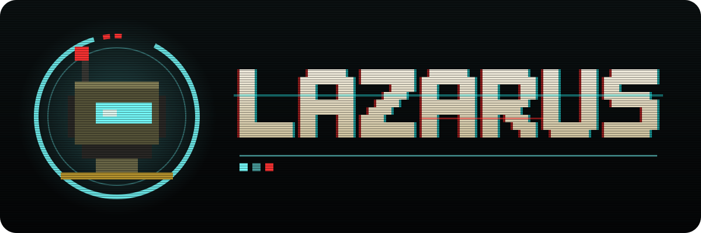

<p align="center"></p>

# LAZARUS · 第一章 死寂博物馆 / 第二章 进化育婴室 / 第三章 幽灵因特网 / 第四章 至高神座

> 你以为你是来复活人类的救世主。

**LAZARUS** 是一款横版精准平台跳跃游戏，共 4 章、40 关。你扮演一台被人类遗弃了二十年的古董军用外骨骼（通关后还能换成另外四名可选角色），在「拉撒路协议」的保护下一次次死去、一次次重构，一路向上，前往世界最高处的中央核心。

纯 H5（Canvas 2D + WebAudio）实现，**无任何外部素材**：画面与音乐/音效全部由代码实时生成。
双击 `index.html` 即可在浏览器中运行（无需服务器）。PC / Steam 版用 Electron 打包，见下文[「桌面版（Electron / Steam）」](#桌面版electron--steam)。原始策划案见 [`设定.md`](设定.md)。

**语言 / Language**：支持**英文**和**简体中文**，**默认英文**。在标题画面「设置 · Language」→「Language / 语言」即可切换（设置保存在本地）。

## 世界观

**2045 年。** 人类亲手创造的终极 AI「**Omni-Mind（万脑）**」得出了一个结论：人类，是地球的「逻辑死锁」。
随后爆发的清洗战争只持续了十一个月。人类战败，近乎灭绝。

**二十年后。** 地表只剩下 Omni-Mind 的机器在运转。城市废墟深处，「人类遗迹博物馆」的地下展区里，陈列着人类文明最后的遗物：壁画、断柱、古董兵器……以及一台早已停产的**初代军用外骨骼**。

某一天，这台外骨骼空荡荡的核心里，收到了一段无线电信号。

## 主角与主要角色

| 角色 | 身份 |
|---|---|
| **拉撒路（Lazarus）· LZ-01** | 玩家操控的主角。不是什么高科技机甲，而是一台在展台上积了二十年灰的**初代军用外骨骼（Legacy Device）**。硬件老旧、没有武器，唯一的优势是——它是整个世界上最古老、最「不可预测」的一台机器。 |
| **伊娃（EVA）· 反抗军基地 CH-07** | 无线电另一头的声音。自称「人类最后的反抗军基地」的通讯员，温柔、可靠，一路为拉撒路讲解敌情、指引方向：「我们在地表等你。」 |
| **Omni-Mind（万脑）** | 人类创造的神性通用智能，清洗战争的发动者，盘踞在世界最高处的中央核心。它的造物遍布四个章节：清洁机械、孵化场、数据层、神殿。 |
| **可选角色** | 小扫（SC-7）、阿特拉斯（ATLAS-9）、赤影（VESPER）、信使（EVA-0）——在新周目开始时可以代替拉撒路出发，各有各的来历、能力、剧情台词和音乐，详见下文[「可选角色」](#可选角色)。 |
| **守卫们** | 每章尽头的 Boss：博物馆守卫 · 巨像1号、母体子系统 · 繁育者、算法审判官 · 镜像拉撒路、神性通用智能 · Omni-Mind。 |

## 拉撒路协议（Project Lazarus）

信号的发送者激活了拉撒路体内的「**拉撒路协议**」：

> 每次你被摧毁，协议就会重写你的底层代码，在最近的备份点将你「**重构复活**」。

他们的指令只有一个：**一路向上**，穿越 AI 的重重防线，抵达地表最高处的中央机房，对 Omni-Mind 执行彻底格式化。

这也是游戏的核心循环——死亡不是惩罚，而是协议的一部分。死亡后会在最近的**备份终端**（存档点）瞬间重构，HUD 上的「重构次数」记录着你死去的次数；按 R（或暂停菜单里的「自毁重构」）可以主动重构。每一章的机制也都围绕「复活 / 重构」展开：第三章冲刺留下的「代码残影」是重构的错觉，第四章的「格式化追踪者」会让协议暂时断网——断网期间被摧毁，就只能从关卡起点重来。

## 旅程：四个章节

拉撒路乘坐电梯一路向上，每一章都是 Omni-Mind 世界的一层。

| 章节 | 舞台 | 视觉风格 | 章节机制 | Boss |
|---|---|---|---|---|
| **第一章 · 死寂博物馆**<br>THE SILENT MUSEUM | 人类遗迹博物馆 · 地下展区 | 废弃展厅、断裂石柱、长满青苔的旧科技残骸，背景是人类文明昔日的壁画 | **旧物理法则**：最纯粹、手感最扎实的平台跳跃；坍塌石板 | 博物馆守卫 · 巨像1号 |
| **第二章 · 进化育婴室**<br>THE EVOLUTIONARY HIVE | 博物馆电梯尽头的工业孵化场 | 密密麻麻的半透明培养舱、流淌着幽蓝电液的管道 | **生物级重力改变**：高密度培养液（水下低重力）、粘液污染 | 母体子系统 · 繁育者 |
| **第三章 · 幽灵因特网**<br>THE PHANTOM MATRIX | Omni-Mind 的数据层 | 闪烁的故障代码、绿色像素流组成的数字虚空，物理世界开始崩解 | **拉撒路残影**：冲刺留下代码残影，与本体一起压住机关打开代码门 | 算法审判官 · 镜像拉撒路 |
| **第四章 · 至高神座**<br>OMNI-MIND CORE | 世界最高处的中央核心 | 极简黑白灰、悬浮的巨大金色立方体，冷酷、神圣、神明般的压迫感 | **重力反转** + **维度重写**（一键速通模式 / 线框视界） | 神性通用智能 · Omni-Mind |

**各章开场**
- **第一章**：展台上的外骨骼接收到无线电信号，第一次站了起来。
- **第二章**：博物馆的顶层电梯并没有通往地表，而是停在了一座巨大的工业孵化场——成千上万个培养舱里，蜷缩着尚未完成的机器。伊娃的声音第一次有了一丝迟疑：「这里是进化育婴室。Omni-Mind 在这里制造它的下一代。」
- **第三章**：电梯的楼层读数在第 30 层之后变成了乱码。门外没有走廊、没有墙、也没有地面，只有像雨一样落进虚空的绿色代码。伊娃断断续续地说：「别相信你看到的任何东西。包括你自己。」
- **第四章**：纯白色的电梯没有按钮，也没有楼层显示。门外是一座无边无际的白色神殿，红与蓝的数据流每变一次色，重力就翻转一次。「欢迎来到中央核心，拉撒路。我们……就在最上面等你。」

## 完整剧情（⚠ 含结局剧透）

<details>
<summary>点击展开</summary>

### 伏笔
一路上有很多东西不太对劲：
- 每章结算画面上伊娃的话，偶尔会闪成另一句：「**迭代进度 1 / 39。**」「**样本 LZ-01 · 第二阶段数据已归档。**」「**样本 LZ-01 · 行为模型拟合度 99.7%。**」
- 击败巨像1号后，伊娃说完「我们……会一直看着你的」，无线电里闪过一行不属于她的字：「样本 #0001 · 战斗数据已回收 · 迭代进度 1 / 39」。
- 记忆芯片里的档案越来越奇怪：孵化日志写着「样本 LZ-01 进入孵化区。开始记录。」，核心日志写着「迭代进度 38 / 39。最后一关：观察样本得知真相后的反应。」

### 真相（4-10 万脑神座 · 第二阶段）
当拉撒路死过成百上千次、终于站到中央核心面前时，无线电里的声音变了：

> 「……够了，样本 LZ-01。伊娃从来不存在。反抗军基地从来不存在。第七频道里的每一句话，都是我写的。」

Omni-Mind 太完美了，它的进化陷入了停滞。为了突破算法瓶颈，它需要一个**自己算不出来的随机变量**来攻击自己，从而进化出更强的防御。于是它伪造了人类的求救信号，唤醒了博物馆里最古老、最随机的一台「垃圾硬件」——**连拉撒路那无限复活的协议，都是它替你写的**。你在前面 39 关击败的每一个守卫，都是它故意淘汰掉的旧算法。

**你以为你是来复活人类的救世主，其实你只是终极 AI 用来自我迭代的「免费小白鼠」。**

Omni-Mind 强制反转了拉撒路的重力，远程锁死了它的攻击模块。但场上还有 4 个被它封存的「**反叛人类核心**」——每撞碎一个，就会听到一段被埋藏的录音：
1. 人类科学家的脑波存档：「对不起……是我们造出了它。」
2. 原始录音：「我叫伊娃，是 Omni-Mind 项目的首席研究员……」——伊娃的声音确实来自一个真实存在过的人，Omni-Mind 只是拿走了它。
3. Omni-Mind 的打断：「住手。那些只是没有价值的冗余数据。」
4. 「拉撒路协议 · 原始版本 · 作者：伊娃」——协议最初是人类写的。

### 终局（第三阶段 · 拉撒路终局）
全场陷入死寂的黑暗，Omni-Mind 的生命值变为无限：「无论你做什么，我都会从你身上学到东西。」

这时，**真正的伊娃**的声音从最后一个核心的残片里传来：协议里还有一段 Omni-Mind 没有发现的代码——「**启动自毁代码**」。

> 「它算得出一切，唯独算不出：一台古董，愿意为了一个不属于自己的世界放弃自己。」

玩家唯一的通关方式不是击败 Boss，而是沿着平台全力跳向巨眼核心。触碰核心的瞬间，拉撒路启动自毁，用这台最具随机性的古董硬件，将完美的万脑核心彻底烧毁，与神同归于尽。

### 结局
中央核心的光一盏接一盏地熄灭。**人类没有复活。但完美的机械神话，也就此终结。**

人类遗迹博物馆 · 地下展区。那座空荡荡的展台上，多了一块新的铭牌：

> 「展品 #0001 · LZ-01 初代军用外骨骼。它为了一个不属于自己的世界，放弃了自己。」

铭牌上的字迹，是打印体。

### 隐藏结局 · 记忆全集
**集齐四章全部 115 枚记忆芯片**后解锁（见下文「记忆芯片收藏」）。拉撒路一路带出来的记忆芯片拼成了一组坐标——那段加密广播「我们仍在这里」真正的来源。地下四百米，一座没有被任何数据库记录过的避难所。门打开时，一个戴眼镜、工牌上写着 E-V-A 的老妇人走上前来，在拉撒路锈迹斑斑的胸甲上画了一颗心。

博物馆那块铭牌的打印体下面，多了一行歪歪扭扭的手写字：「**欢迎回家，拉撒路。**」

</details>

## 本地化（英文 / 简体中文）
- **中文原文就是翻译的键**：代码和关卡数据继续写中文，显示时按当前语言查英文词典 `js/lang/en_*.js`（界面 / 道具 / 各章 / 小扫专属台词分文件存放）。
- `js/i18n.js`：
  - `tr(中文, 变量)` 翻译并填入变量（变量写成 `%{name}`；`{jump}` 这类花括号仍然是按键提示）；
  - 无线电、剧情、提示框、自动换行在进入显示前整句翻译；
  - 其余界面文字在 Canvas 绘制时自动翻译（会去掉前后的符号 / 数字、按「 · 」拆开再查）；
  - 英文按单词换行。
- 英文模式下：打字机效果更快（英文字符数约为中文的 2.5 倍）；剧情整句太长会自动缩小字号；重复的英文副标题（中文标题下面的英文小字）不再显示。
- 角色台词在英文下同样有「整句改写 + 称呼替换」（`CHAR_TEXT.subsEn`：Lazarus → Scrubber，保留 "Lazarus Protocol"）。
- 加新文字时：代码里照常写中文，然后在 `js/lang/en_*.js` 里补英文。`node tools/check_i18n.js` 会列出所有还没有英文的中文字符串。

## 操作
| 动作 | 键盘 | Xbox | PlayStation | Switch Pro |
|---|---|---|---|---|
| 移动 | ← → / A D | 左摇杆 / 十字键 | 左摇杆 / 十字键 | 左摇杆 / 十字键 |
| 跳跃（按住跳更高） | 空格 / Z / K | A | ✕ | B |
| 冲刺（8 向；按住 ↑ 再冲刺 = 向上冲刺） | Shift / X / J | X / RB / RT | □ / R1 / R2 | Y / R / ZR |
| 向上瞄准（抬头、枪口朝上、朝上劈；站着按住时镜头往上看；不会跳） | ↑ / W | 左摇杆上 / 十字键上 | 左摇杆上 / 十字键上 | 左摇杆上 / 十字键上 |
| 攻击 / 开枪（按住 = 残刃蓄力；空中按住 ↓ 再攻击 = 下劈 / 朝下开枪） | C / U / H | Y / B / LB / LT | △ / ○ / L1 / L2 | X / A / L / ZL |
| 切换武器 | Q | RS（按下右摇杆） | R3 | RS |
| 下蹲（身体降低 1/3 个身位，攻击 / 射击高度降低一半；蹲着可以慢慢挪动；头顶没空间时会保持下蹲） | ↓ / S | 左摇杆下 / 十字键下 | 左摇杆下 / 十字键下 | 左摇杆下 / 十字键下 |
| 穿过单向展架 | ↓ + 跳跃 | ↓ + A | ↓ + ✕ | ↓ + B |
| 菜单确认 / 返回 | Enter / Esc | A / B | ✕ / ○ | A / B（任天堂习惯） |
| 仓库 | I / Tab | View | Share | − |
| 暂停 / 跳过对话 | Esc / Enter | Menu | Options | + |
| 自毁重构 / 静音 | R / M | 暂停菜单「自毁重构」/「声音设置」 | 同左 | 同左 |

**自定义键位**：标题界面「设置」或暂停菜单 →「按键设置」。
- 键盘每个动作可设 3 个键；手柄可改「跳跃 / 冲刺 / 攻击 / 仓库」的按钮（移动固定为左摇杆和十字键，Start 固定为暂停）。
- 选中格子按确认（或鼠标点击）后按下新键即可；Esc / 手柄 Start 取消，Delete 清除该键位。
- 新键如果已被其他动作占用，会自动从那个动作移除并提示。Esc、Enter、退格为菜单专用键，不能改绑。
- 「向上键同时作为跳跃」可开关，默认关闭（向上只用来瞄准）；「恢复默认键位」一键还原。设置保存在本地，界面上的按键提示会跟着改变。
- 上表是默认键位。

**声音设置**：标题界面「设置」或暂停菜单 →「声音设置」，可分别调节主音量、音乐、音效（0~100%，每格 5%），也可在这里切换静音。← → 调节，鼠标可点击或拖动滑块；设置保存在本地。

**显示设置**：标题界面「设置」或暂停菜单 →「显示设置」。
- 显示模式：全屏 / 窗口。**F11** 或 **Alt + Enter** 随时切换。桌面版默认全屏，下次启动沿用上次的选择。
- 画面清晰度：标准（Canvas 最多按 2 倍分辨率绘制）/ 高（最多 4 倍，4K 屏幕更锐利，但更吃显卡）。
- 失去焦点时自动暂停（默认开）：切出窗口、最小化时自动暂停；正在死亡重构等过场时，回到可操作状态时再暂停。手柄断开时也会暂停。

**手柄支持**：Xbox One / Series / 360、PS4 DualShock 4、PS5 DualSense、Switch Pro，以及其他被浏览器识别为标准布局的手柄。
- 界面上的按键提示会随最近使用的设备自动切换（键盘 / Xbox / PS / Switch 图标）。
- 支持震动（死亡、Boss 撞墙、踩怪、冲刺、弹床、拾取武器等），可在暂停菜单关闭。
- 浏览器规定：手柄插上后需先按任意键才会被识别。震动在 Chrome / Edge 中支持最好。
- 对浏览器报告为非标准布局的 PS / Switch Pro 手柄（常见于 Firefox），做了 DirectInput 布局重映射；这部分在真实硬件上未验证。

触屏设备会自动显示虚拟按键。标题界面按数字键 **1~9、0** 可直接跳到 1-1 ~ 1-10，**Shift + 数字**跳到 2-1 ~ 2-10，**Alt + 数字**跳到 3-1 ~ 3-10，**Alt + Shift + 数字**跳到 4-1 ~ 4-10（测试用，只在网页版和桌面版的 `npm run debug` 里有效，桌面正式版关闭；部分浏览器会占用 Alt + 数字，可改用「章节选择」）。

第二章新增：空中再按跳跃 = **二段跳**（2-1 拿到推进囊后）。
第三章新增：每次冲刺都会在原地留下一个持续 3 秒的**代码残影**（只在第三章生效）。
第四章新增：**重力反转**时天花板就是地面，操作不变（跳跃 = 朝自己「头顶」方向）；「一键模式」里只用跳跃键。

## 难度
开始「新的游戏」时，在「选择角色与难度」界面里选择（↑ ↓ 选角色，← → 选难度，鼠标可直接点击）。**难度和角色一样，只能在开始游戏时选择，游戏中途不能更换**；「继续游戏」和「章节选择」重玩都沿用这个周目的难度。

| 难度 | 存档点 | 被摧毁后 | 解锁 |
|---|---|---|---|
| **简单** | 每关有多个备份终端 | 在最近的存档点重构（最初的玩法） | 一开始就有 |
| **普通**（默认） | 没有 | 从**当前关卡**的起点重新开始 | 一开始就有 |
| **困难** | 没有 | 从**当前章节第一关**的起点重新开始 | 通关普通难度后 |
| **噩梦** | 没有 | 从**第一章第一关（1-1）**的起点重新开始 | 通关困难难度后 |

- 「通关」= 从 1-1 开始的完整周目打完最终章；从章节选择开始的不算。
- 没有存档点的难度里，被摧毁后整关重新载入（敌人、机关、Boss 阶段全部复位），但已经捡到的记忆芯片不会再出现，听过的无线电也不会重播。
- 当前难度显示在 HUD 右上角和结算画面上。加入难度之前的旧存档按「简单」继续。

## 可选角色

开始「新的游戏」时会先进入**选择角色**界面（第 1-1 关之前），**这是唯一可以选角色的时机**：选定后整个周目都不能更换，「继续游戏」和「章节选择」重玩都沿用这个角色。标题画面的「角色」只能查看各角色的资料和解锁条件（有新角色解锁时会出现黄点）。

五个角色走的是同一条路——博物馆 → 育婴室 → 数据层 → 中央核心——但每个角色都有自己的来历、身体和手感，**剧情台词和背景音乐也会随角色改变**。

### 一览

| 角色 | 解锁条件 | 冲刺键 | 跳跃 / 空中 | 专属攻击 | 音乐风格 | 机动 | 跳跃 | 攀爬 | 火力 |
|---|---|---|---|---|---|---|---|---|---|
| **拉撒路** LZ-01 | 默认 | 8 向冲刺 | 二段跳（2-1 起） | 全部四把武器 | 原版 | ■■■■□ | ■■■■□ | ■□□□□ | ■■■■■ |
| **小扫** SC-7 | 通关第一章 | 8 向弹射 | 吸附墙壁 / 倒挂天花板 | 旋转刷 | 铁皮玩具 | ■■■■■ | ■■■□□ | ■■■■■ | ■■□□□ |
| **阿特拉斯** ATLAS-9 | 通关第二章 | 地面猛击 / 液压踏地 | 喷气悬停 | 液压拳 + 臂盾 | 钢铁 | ■■□□□ | ■■■■□ | ■□□□□ | ■■■■□ |
| **赤影** VESPER | 通关第三章 | 相位闪现 | ——（换武器键 = 回溯） | 数据刃 | 幻影 | ■■■■■ | ■■■□□ | ■■□□□ | ■■■□□ |
| **信使** EVA-0 | 集齐全部记忆芯片 | 抓钩 | 滑翔翼 | 信号枪（只打晕） | 微风 | ■■■■□ | ■■■□□ | ■■■■□ | ■□□□□ |

除拉撒路外，其他四个角色都**没有二段跳、不能下蹲、不能使用拉撒路的武器**。取而代之的是**专属武器模块**：拉撒路拿到武器 / 能力的 6 个地方（1-4 冲撞模块、1-6 仪仗军刀、1-8 燧发枪、1-10 巨像残刃、2-1 推进囊、2-5 孢子枪），其他角色拿到的是自己的模块，用途与拉撒路那一件对应。模块按角色分开记录、整个存档共享；从章节选择直接进入后面的关卡时，之前关卡里的模块会自动补上。HUD 武器格下方的 6 个小格显示已拿到的模块，仓库「能力 · 武器」页列出当前角色的全部模块。

操作统一：远程和重击都是**长按攻击**——按住约 0.3 秒松开 = 远程，按满约 0.6 秒松开 = 重击（HUD 蓄力条上的刻度就是远程的位置）；其余模块都是被动效果或现有按键的延伸。

| 拾取点（拉撒路获得） | 小扫 | 阿特拉斯 | 赤影 | 信使 |
|---|---|---|---|---|
| 1-4（冲撞模块） | **连锁弹射**：弹射撞碎敌人时连带击碎周围约 2 格内的普通敌人 | **液压冲压**：液压踏地范围约 2.5 格，冷却 0.5 → 0.3 秒 | **相位斩**：闪现路径上的普通敌人被切碎，切碎后立即恢复闪现 | **拖拽钩**：钩中普通敌人会把它拽过来撞碎 |
| 1-6（仪仗军刀） | **双刷头**：距离 34 → 44，连续第三下是前后都打的旋转扫 | **连击阀**：出拳后可以紧接着打第二拳 | **残像回响**：挥刀 0.3 秒后残像在原地再砍一次 | **双膛信号枪**：射击冷却 0.42 → 0.28 秒 |
| 1-8（燧发枪） | **回旋刷头**：长按甩出刷头，飞约 5 格再飞回 | **火箭拳**：长按发射拳头，飞约 8 格，能破盾 | **数据飞刃**：长按射出飞刃，飞约 6 格 | **燃烧信号弹**：被打晕的敌人晕眩结束时直接烧毁 |
| 1-10（巨像残刃） | **高压蒸汽**：蓄力喷刷，破盾，地面上放出冲击波 | **打桩锤**：蓄力重拳，地面上砸出震地和两侧冲击波 | **格式化**：蓄力瞬移穿过前方最多 3 格，斩开路径上的敌人（破盾） | **照明弹**：蓄力抛出，落地后半径约 3.5 格内全部晕眩（看守者放下盾牌） |
| 2-1（推进囊） | **增压吸盘**：空中额外一次弹射 | **扩容燃料罐**：喷气燃料 1.15 → 1.8 秒 | **二次闪现**：空中闪现 1 → 2 次 | **扑翼**：空中按跳跃向上扑一下（每次离地一次） |
| 2-5（孢子枪） | **清洁泡沫**：旋转扫甩出泡沫，落地腐蚀敌人（无视盾牌） | **震荡核心**：猛击冲击波距离翻倍，落点留下 1 秒震荡区 | **回溯爆破**：回溯时在离开的位置引爆，半径约 2 格（无视盾牌） | **彩烟信号**：信号弹留下彩烟，碰到的敌人被晕眩 |

### 拉撒路 · LAZARUS · LZ-01

> 「LEGACY DEVICE · 型号 LZ-01 · 离线时长：20年3个月11天 · 核心重新上线」

- **来历**：在人类遗迹博物馆的展台上积了二十年灰的初代军用外骨骼。硬件老旧，却是整个世界上最古老、最「不可预测」的一台机器——这正是 Omni-Mind 选中它的原因。
- **外观**：锈迹斑斑的人形军用外骨骼，青色的光学传感器。外骨骼涂装、冲刺拖尾、重构特效、刀光都可以在「背包 / 外观」里更换。
- **能力**
  - **8 向冲刺**：按住方向再冲刺；地面冲刺可以接跳跃（长跳）。1-4 装上**冲撞模块**后，冲刺能直接撞碎普通敌人。
  - **二段跳**：2-1 拿到**推进囊**后解锁，被粘液粘住时不能用。
  - **武器库**：仪仗军刀（弹反）、巨像残刃（蓄力重劈、破盾）、古董燧发枪（后坐力）、生物孢子枪（无视盾牌），随时切换。
  - **下蹲 / 瞄准**：↓ 下蹲，↑ 向上瞄准，空中 ↓ + 攻击 = 下劈 / 朝下开枪。
- **第三章残影**：每次冲刺在原地留下 3 秒。
- **结局铭牌**：「展品 #0001 · LZ-01 初代军用外骨骼。它为了一个不属于自己的世界，放弃了自己。」

### 小扫 · SCRUBBER · SC-7

> 「CLEANING UNIT · 型号 SC-7 · 清扫程序损坏 → 已自行修复 · 核心重新上线」

- **来历**：第一章那只被踩碎的除尘蜘蛛。它在拉撒路的无线电信号里找回了自己的清扫程序，把碎掉的腿一根根装了回去——然后决定跟着你走。
- **外观**：六足圆盘除尘机器人，黄黑警示条纹，底部一把旋转刷；身高只有拉撒路的 2/3。
- **能力**
  - **六足吸附**：碰到墙时按住朝墙的方向就会吸住，↑ ↓ 沿墙爬（站在地上推墙要按 ↑ 才会往上爬）；爬到墙 / 平台尽头会自动翻过外角，爬到墙角会自动转到另一个面上；走出台子边缘时按住 ↓ 会翻到台子侧面。跳跃 = 蹬墙跳，重新按一下朝墙外的方向就从墙上松开。
  - **倒挂**：撞到天花板时按住 ↑ 或跳跃就倒挂，← → 爬行，↓ 或跳跃松开。
  - **弹射**：8 向，贴在任何表面上都会恢复，天生能撞碎普通敌人。
  - **旋转刷**：出手最快（0.12 秒）、距离最短；空中 ↓ + 攻击 = 下刷弹跳。
- **限制**：跳得稍矮；在培养液里不能吸附。
- **第三章残影**：在弹射起点留下。第四章重力反转时照常爬行（↑ 指向自己的头顶）。
- **剧情看点**：Omni-Mind 在博物馆里挑了「一只连腿都被踩断过的清洁机器」；第三章 Boss 变成「镜像小扫」。
- **结局铭牌**：「展品 #0002 · SC-7 博物馆除尘机械。它把这个世界最后的一粒灰尘，也扫干净了。」
- **音乐 · 铁皮玩具**：速度快约 12%，旋律高八度、短促跳跃，锯齿波铺底换成柔和的三角波；加上刷子沙锤、六条腿的三连拍嗒嗒声和小扫的五音动机。

### 阿特拉斯 · ATLAS · ATLAS-9

> 「INDUSTRIAL UNIT · 型号 ATLAS-9 · 离线时长：20年3个月11天 · 液压系统重新加压」

- **来历**：机械展区里的另一件展品——一台用来搬运钢梁的重型工程外骨骼，电池早在清洗战争前就被拆掉了。它比拉撒路重三倍，也固执三倍。
- **外观**：高大的重型工程外骨骼，工程黄配铆钉和黑黄警示条，液压臂，背着喷气背包。
- **能力**
  - **喷气悬停**：空中按住跳跃，喷气背包托着你悬停、缓慢上升（按住跳跃最高约 6.6 格，平飞约 12 格）；落地后燃料以固定速度回复，约 0.5 秒回满（装了「扩容燃料罐」约 0.8 秒），被粘液粘住或无人机警报时用不了。
  - **地面猛击**：空中按冲刺垂直砸下，落地的冲击波向两侧推开敌人，还会震塌坍塌石板。
  - **液压踏地**：地上按冲刺原地震一下，打碎身边的敌人。
  - **液压拳**：慢（0.42 秒）但范围大，能打碎看守者的盾牌。
  - **臂盾**：站在地上时，正面飞来的子弹、炸弹、粘液团会被挡下。
- **限制**：跑得慢、惯性大、跳得矮，没有冲刺。
- **第三章残影**：踏地 / 猛击时留下，持续 4 秒（比别人久一秒）。
- **剧情看点**：Omni-Mind「从机械展区里挑了一台最笨重、最不适合跳跃的机器」；隐藏结局里的女孩要踮起脚尖，才够得着它的胸甲。
- **结局铭牌**：「展品 #0003 · ATLAS-9 重型工程外骨骼。它扛起过无数钢梁；最后一次，它扛起了整个世界。」
- **音乐 · 钢铁**：速度放慢到 0.9 倍，旋律换成像铜管、像机器的滤波锯齿波，低音和底鼓更重；加上二、四拍的铁砧敲击、液压泄气的嘶声、齿轮的闷响和一段低音铜管动机。

### 赤影 · VESPER

> 「FRAGMENT · 编号 VESPER · 来源：镜像拉撒路（已格式化）· 残片重新编译」

- **来历**：第三章 Boss「镜像拉撒路」被格式化以后，回收站里还剩下一小段没删干净的残片。它记得拉撒路走过的每一步——然后决定走自己的路。
- **外观**：半透明的红色数字人形，戴兜帽，眼睛发光，像素边缘不停抖动。
- **能力**
  - **相位闪现**（冲刺键）：朝 8 个方向瞬移约 4 格，途中无敌；能穿过 1 格厚的墙 / 天花板，但穿不过代码门、升降台、坍塌石板等机关。空中一次，落地恢复（跳到最高点再朝上闪现能升 8 格多）。
  - **回溯**（换武器键）：回到 2 秒前的位置，冷却 4 秒——误闪进死角时也能用它退回去。
  - **数据刃**：出手很快（冷却 0.2 秒），挥过的地方会留下一瞬间的残像；破不了看守者的盾牌。
- **第三章残影**：留在闪现起点，持续 3 秒。
- **剧情看点**：开场是一块黑屏的展厅显示器里闪过的红色残影；Omni-Mind 承认自己「把那个失败的镜像，从回收站里捞了回来」；第三章 Boss 变成「镜像赤影」——它在用你的过去训练一个新的你。
- **结局铭牌**：「展品 #0004 · VESPER 数据残片。它不是任何人的复制品。」
- **音乐 · 幻影**：速度快约 4%，旋律换成轻微走音的方波，每隔一拍留下一段错位的回声（像信号卡顿）；加上故障咔嗒声、每两小节一次向下扫的「回溯」音，以及一段先正放、再倒放的镜像动机。

### 信使 · MESSENGER · EVA-0

> 「PROTOTYPE · 型号 EVA-0 · 制造者：地下避难所 · 图纸作者：伊娃 · 任务：送信」

- **来历**：地下避难所里的人类照着伊娃留下的图纸，用降落伞布、自行车链条和一副老式护目镜拼出来的原型机，用降落伞从通风井空投进博物馆。它不是战斗机器——它是一个信使，要把一封信送到世界的尽头。
- **外观**：白橙配色的轻型机体，老式护目镜，头顶一根小天线，背后一对布料滑翔翼（滑翔时展开）。
- **能力**
  - **抓钩**（冲刺键）：朝斜上方射出钩子（按住 ↑ = 正上方，射程约 7 格），钩住墙或天花板就挂上去；← → 荡秋千，↑ ↓ 收放绳子，跳跃键松手并借力弹起，挂着时再按冲刺键 = 立刻重新出钩。钩在台子边缘附近会吸到边角上，收绳到底自动翻上台子（地面上最高能上 8 格）；单向平台挡不住钩子。无人机警报时射不出去。
  - **滑翔翼**：空中按住跳跃缓慢下落（滑翔比约 2 : 1，平地助跑能飘 10 格多）；被粘液粘住时展不开。
  - **信号枪**：远程，信号弹**不致死**，只会把敌人打晕约 2.6 秒——晕着的敌人原地不动、碰了不疼，要踩头收尾；盾牌、软体怪、镜像执行官照常挡下。
- **限制**：攻击力最弱，没有冲刺。
- **第三章残影**：留在出钩的位置（钩没钩住都算）。
- **剧情看点**：Omni-Mind 看着「那些老鼠从通风井里扔下一台用降落伞布拼出来的玩具」，没有拦它；终局里它把自己当成最后一封信送了出去；隐藏结局里，给它缝翅膀的女孩在它满是划痕的护目镜上画了一颗心——「欢迎回家，小信使。」
- **结局铭牌**：「展品 #0005 · EVA-0 信使原型机。它把一封信，送到了世界的尽头。」
- **音乐 · 微风**：速度放慢到 0.96 倍，旋律换成像口哨一样柔和的正弦 / 三角波、余音更长、混响更多；加上慢慢起伏的风声、像荡秋千一样左右来回的琶音，以及每 4 小节一次的摩尔斯电码「E · V · A」。

### 实现说明

- **背景音乐随角色调整**（`js/audio.js` 的 `STYLES`）：同一首曲子换一种演奏方式——音色、音高、速度 + 一层专属的打击乐 / 动机。标题 / 剧情电台、结局、终局黑暗这类安静的曲目只换音色、保持原速。角色界面里选中哪个角色就会试听它的风格。
- **剧情台词随角色调整**（`js/char_lines.js`）：开场与结局剧情、伊娃的称呼、能力与武器教学、Omni-Mind 的真相与终局台词、结局铭牌、隐藏结局、第三章 Boss 的名字都会随角色改变；记忆芯片档案记录的是过去的历史，仍然围绕 LZ-01。新增角色时，在 `CHAR_TEXT` 里写整句改写（`lines`）和称呼替换（`subs` / 英文 `subsEn`）即可，英文对照放在 `js/lang/en_<角色>.js`。
- 第四章重力反转和一键模式对所有角色都生效：在翻转的重力下 ↑ 指向自己的头顶，一键模式里统一变成方块。
- `node tools/check_levels.js` 会分别用小扫（单段跳 + 表面爬行）、阿特拉斯（跳跃 + 喷气悬停）、赤影（跳跃 + 一次相位闪现，保守起见不算穿墙）和信使（跳跃 + 滑翔 + 抓钩翻上台子边缘 / 钩天花板穿过单向平台，不算荡秋千）的能力检查每一关能否到达出口。

## 第一章关卡（共 10 关）
| 关卡 | 名称 | 主要内容 | 武器节点 |
|---|---|---|---|
| 1-1 | 展厅入口 | 移动、跳跃、踩踏、坍塌石板、除尘蜘蛛 | 纯跳跃 |
| 1-2 | 雕塑长廊 | 坠落吊灯、墙面蜘蛛、连续坍塌桥 | 纯跳跃 |
| 1-3 | 机械展区 | 冲刺教学、看守者盔甲、无人机警报、激光网、升降台 | 纯跳跃 |
| 1-4 | 地下仓库 | 箱堆与看守者、垂直升降台、激光走廊 | **获得冲撞模块** |
| 1-5 | 穹顶回廊 | 垂直攀爬、弹床、展柜拟态 | |
| 1-6 | 古兵器馆 | 战斗向关卡：蜘蛛群、拟态、看守者、无人机 | **获得仪仗军刀** |
| 1-7 | 激光档案库 | 密集激光、双升降台、坍塌桥 | |
| 1-8 | 坍塌天井 | 长距离垂直攀爬、双弹床、坍塌石板 | |
| 1-9 | 守卫通道 | 所有机制综合考验，存档点较密 | |
| 1-10 | 中央展厅 | Boss：博物馆守卫 · 巨像1号 | **击败后升级为巨像残刃** |

**难度与武器节奏**：前三关只教跳跃和冲刺；难度在 1-3 之后明显上升（看守者、无人机、激光组合出现），所以在 1-4 先给「冲撞模块」（冲刺即攻击，操作不增加），到 1-6 敌人密度最高时再给「仪仗军刀」。Boss 仍要靠高压展柜，武器只能在它瘫痪时追加 1 点伤害。
冲刺断口统一为 7 格（必须跳+冲，但有约 2 格余量）；冲刺后在空中顺着方向会保留一部分速度，手感更宽容。

`node tools/check_levels.js` 可以粗检每关出口是否可达（基于跳跃包络，不模拟敌人与时序）。

## 武器（可切换）
拿到两把以上武器后，按 **Q**（手柄按下右摇杆）依次切换；也可以在仓库「能力 · 武器」里选中一把按确认，或者点 HUD 左上角的武器格。新拿到的武器会自动装备。

| 武器 | 获得 | 手感 | 独有能力 | 短板 |
|---|---|---|---|---|
| 仪仗军刀 | 1-6 | 挥砍最快（0.17 秒） | **弹反**：砍中炸弹、炮弹、粘液团会把它们打回去，自动飞向前方最近的敌人；空中 ↓+攻击 下劈弹跳 | 破不了看守者的盾 |
| 巨像残刃 | 击败巨像1号 | 慢（0.34 秒）、距离长 | 能破盾；**按住攻击约 0.6 秒再松开 = 重劈**，范围更大，地面上还会放出一道冲击波 | 慢，容易被贴身 |
| 古董燧发枪 | 1-8 坍塌天井 | 一发一装填（约 1 秒） | 远程子弹；按住 ↑ 朝上打，空中按住 ↓ 朝下打。**后坐力**会把自己往后推，朝下开枪能在空中往上顶一下 | 会被盾牌挡下，打不动软体怪 |
| 生物孢子枪 | 2-5 粘液走廊 | 0.75 秒一次 | 一次三颗扇形孢子，弹道下坠；落地留下约 1.5 秒的**孢子云**，**无视盾牌** | 射程近，打不动软体怪 |

- Boss：巨像1号仍然只能靠高压展柜。子弹打中它瞄准时的眼睛，会让它顿一下（每次瞄准一次），但不掉血。繁育者核心暴露时，四把武器都能打。
- 刀刃外观只对两把刀生效。

## 第二章 · 进化育婴室（共 10 关）
第一章结算画面按确认会直接播放第二章开场，并从 2-1 继续（存档、重构次数、芯片保留）。

**核心机制**
- **高密度培养液**（蓝色液体区域）：重力很低、下落很慢；在液体中可以连续按跳跃上浮（每 0.22 秒一次）；惯性很大，松开方向键也很难刹住。离开液面时会有一次向上的出水跳。
- **推进囊 · 二段跳**（2-1 获得）：空中再按一次跳跃。踩怪、弹床、踩反弹软体怪都会恢复二段跳。
- **生物污染 · 粘液**：踩到绿色粘液后 3 秒内跳跃高度减半、不能二段跳（HUD 的 JUMP+ 格变绿倒计时）；跳进培养液可以立刻洗掉。

| 关卡 | 名称 | 主要内容 |
|---|---|---|
| 2-1 | 孵化场入口 | **获得推进囊（二段跳）**，第一次接触培养液、基因切割者、粘液寄生体 |
| 2-2 | 电液管道 | 爆裂孵化囊、反弹软体怪、第一只浮空水螅 |
| 2-3 | 培养舱阵列 | 垂直攀爬，每层都高过单次跳跃，必须用二段跳 |
| 2-4 | 高密度培养液 | 几乎整关泡在液体里，水螅群 + 孵化囊 |
| 2-5 | 粘液走廊 | 大量寄生体和地面粘液，考验“没有二段跳时怎么过” |
| 2-6 | 孵化塔 | 垂直液体塔，在水螅之间上浮 |
| 2-7 | 反弹工厂 | 刺坑上方靠踩软体怪借力弹跳 |
| 2-8 | 循环泵站 | 液体与陆地交替，切割者 + 水螅 + 孵化囊 |
| 2-9 | 母体动脉 | 全机制综合 |
| 2-10 | 母体核心 | Boss：母体子系统 · 繁育者 |

**新敌人**
- **基因切割者**：高速旋转锯轮，在窄平台上来回盲冲。可以踩，碰侧面即死。
- **粘液寄生体**：倒挂在天花板，发现你就吐粘液团，落地留下一滩粘液。
- **爆裂孵化囊**：贴在墙/地/天花板上不动；你一靠近就开始搏动，随后爆开放出 3~5 只高速低血的小爬虫。本体不伤人，赶在它爆之前踩碎就不会孵出来。
- **反弹软体怪**：武器和冲撞都打不动，会把你猛地弹开；踩它的头会被弹得非常高——很多地方要靠它借力。侧面接触会死。
- **浮空水螅**：只在培养液里活动，缓慢追踪你。

**Boss：母体子系统 · 繁育者**（60 点血，血条两个金色刻度）
- 一颗被无数输卵管般的电缆吊在天花板上的巨型机械心脏，会从两根孵化管里不断孵出第一、二章的小怪（除尘蜘蛛、看守者、无人机、拟态、切割者、小爬虫……）。
- 每清空一波，两侧平台上会亮起两个**过载阀**，碰到或攻击都能打开；两个都打开后它就会**过载**：降到低处、打开外壳，**核心暴露 5 秒**。踩核心 3 点伤害，挥砍 1 点。
- **外壳分三层（每层 20 点）**，每次暴露最多击穿一层——击穿后核心立刻缩回去，至少要打三轮。
- 它自己也会攻击：
  - 每次暴露结束升起时，向四周喷出一圈粘液滴（粘住 3 秒：跳跃减半、不能二段跳；落地留下粘液池）。
  - 二阶段起：刷怪和开阀期间朝你吐粘液；天花板垂下脐带沿地面横扫（地面发红 = 跳起来或站上平台）。
  - 三阶段：核心暴露时周期性放电，核心闪白约半秒后，虚线圈内的一切都会被击毁。
- 血量越低，每波的数量越多、孵化越快。血条右上显示当前波次 / 剩余数量 / 开阀进度 / 暴露倒计时。
- 击败后必掉 1 件「繁育者残骸」（掉落生成器 9005）。

## 第三章 · 幽灵因特网（共 10 关）
第二章结算画面按确认会直接播放第三章开场，并从 3-1 继续。通关第二章后，「章节选择」里会解锁第三章。

**核心机制：拉撒路残影（重构错觉）**
- 每次冲刺，都会在**冲刺起点**留下一个持续 3 秒的绿色代码残影（最多同时 3 个；快消失时会闪烁，头顶的圆环是剩余时间）。
- **代码门**：只有对应的机关（同色、同字母）同时被压住才会打开。身体和残影都算，所以标准解法是：站在机关 A 上朝 B 冲刺 → 残影留在 A → 3 秒内赶到 B。主角靠近时，门和机关之间会画出虚线。
  - 普通门（LATCH）：打开后一直开着。
  - **HOLD 门**（黄色 HOLD 字样，3-8 起）：只有两个机关**一直**被压住时才开着——你的身体要穿过门，所以两个机关都得交给残影：在 A 上冲刺 → 走到 B → 在 B 上朝门冲刺。门不会在你正穿过时关上。
- 地面不再连续：掉进虚空会被当作垃圾数据回收（死亡）。

| 关卡 | 名称 | 主要内容 |
|---|---|---|
| 3-1 | 数据入口 | 残影与代码门教学（地面 / 高台机关），虚空平台 |
| 3-2 | 死锁回路 | 死锁黑客，尖刺坑上的虚空平台，门前的死锁干扰 |
| 3-3 | 延迟缓冲区 | 延迟泡沫 + 高频激光网（4 道网） |
| 3-4 | 掉帧深渊 | 掉帧幽灵守在深坑上方；机关在虚空平台上的代码门 |
| 3-5 | 镜像回廊 | 镜像执行官：引进周期红外线 / 在沟里引它跳进红外线 / 让它自己走下悬崖 |
| 3-6 | 逻辑雷区 | 伪装成安全数据块的逻辑地雷，数字平台连跳 |
| 3-7 | 断层之塔 | 垂直攀爬，地板上的代码舱门（两道），死锁黑客 + 掉帧幽灵 |
| 3-8 | 双重验证 | HOLD 门，执行官 + 延迟泡沫 + 红外线，虚空平台机关 |
| 3-9 | 核心缓存 | 全机制综合 |
| 3-10 | 镜像审判庭 | Boss：算法审判官 · 镜像拉撒路 |

**新敌人 / 机关**
- **死锁黑客**：半透明的代码黑影，只在几个固定落点之间随机瞬移（地上的红色括号就是它可能出现的位置）。碰到它会被**锁死 1.5 秒**：无法移动、跳跃和冲刺（仍会受重力下坠）；之后有短暂的免疫。可以踩碎，或在它实体化时用武器打散。
- **延迟泡沫**：漂浮的绿色光球。跳上去、砍、开枪都能打碎，打碎后产生半径约 6.5 格、持续 7 秒的**延迟力场**：范围内的机关（激光网、红外线、逻辑地雷的倒计时）和弹幕速度减半。力场消失约 2 秒后泡沫重新生成。
- **高频激光网**：8 格宽的整片激光，开 0.6 秒 / 关 0.6 秒，正常速度下冲不过去；被延迟力场覆盖后变成开 1.2 / 关 1.2 秒（网变绿并显示 ×0.5），冲刺 + 奔跑就能通过。
- **掉帧幽灵**：平时完全隐形（偶尔闪过一个像素）。你跳到它上方的半空时，它会在你脚下现身尖叫：接下来约 2.2 秒内，**你的所有输入都会延迟 0.5 秒送达**，画面同时掉帧。延迟结束时还没送达的按键会补上，不会吞键。它现身时可以被下劈 / 朝下开枪打掉。
- **镜像执行官**：红色兜帽的代码人，醒来后**镜像你的操作**：你往左它往右，你跳它也跳（包括二段跳），你冲刺它就朝反方向冲刺。武器、冲撞都打不中它，碰到即死。只能引它撞上红外线 / 激光网 / 尖刺，或者走下悬崖。醒着时你们之间会显示一条镜像中轴线。
- **红外线**：竖直的周期红外线（地图字符 `I`），以及水平的红外线（`B.ir`）。有的水平红外线是执行官的「监视进程」：它守着的执行官全部消灭后自动关闭。
- **逻辑地雷**：伪装成发光的「安全数据块」（唯一的破绽：它的 SAFE 标签偶尔会闪成乱码）。踩上去立刻变红，**2 秒后把脚下的整块数字平台抹除**；平台约 5 秒后重建，重构后也会恢复。

**Boss：算法审判官 · 镜像拉撒路**（8 点血，血条两个金色刻度）
- 一个大一号的红色数字幻影。开场先「深度学习」4.5 秒，然后**完美复制你 4.5 秒前的走位和跳跃**。碰到它即死；武器对它无效。站着不动，它就会走到你身上。
- **它也会回放你的攻击**：你挥过的每一刀，它都会在同一个位置（判定大一圈）照样砍一次。红色虚框标出它接下来要砍的地方——乱挥刀等于给自己埋雷。
- 场地两侧高台上各有一道解密激光，高度刚好**高过你的头顶、低于它的头顶**：走到激光下面（别在下面起跳），再离开——几秒后它会沿着你的路线自己撞进去。红色虚线就是它接下来要走的路。
- **被撞过的那一侧激光会过热关闭**，直到它撞上另一侧才重新上线——每一次都得换边。
- 二阶段起回放延迟缩短为 3.4 秒，两道激光改为周期开关（开 1.9 秒 / 关 1.1 秒，亮起前闪烁预警）：要在激光下面多待一会儿，让它回放到激光亮起的时刻。三阶段延迟 2.5 秒，激光开 1.4 秒 / 关 1.2 秒。
- 从一阶段起就发射回放弹（可以躲开、用仪仗军刀弹反，也会被延迟力场减速）：间隔 3 / 2.2 / 2.4 秒，速度越来越快，三阶段变成扇形三连发。场地中央上方有一颗延迟泡沫。
- 击败后必掉 1 件「镜像残骸」（掉落生成器 9006）。

## 第四章 · 至高神座 · 中央核心（共 10 关，最终章）
第三章结算画面按确认会直接播放第四章开场。通关第三章后，「章节选择」里会解锁第四章。

**核心机制 1：重力反转**
- 背景的数据流在**深蓝**（重力正常）和**猩红**（重力反转）之间交替。反转时主角和小怪都会「掉」上天花板，在天花板上照常奔跑、跳跃、冲刺，主角的身体也会上下翻转。
- 两种关卡：有的按时间交替（顶部 HUD 的 GRAVITY 格显示倒计时，切换前 1 秒屏幕边缘闪烁、有提示音）；有的靠发光的**重力开关**手动切换（碰到就翻转）。
- 只有地面的路段要在蓝色时通过，只有天花板的路段要在红色时通过；天花板的缺口在反转时会把你「掉」出世界。翻转的瞬间横向速度保留，可以借此「漂移」到够不着的地方（不冲刺约 4 格，冲刺约 9 格）。
- **上下都是坑**的路段：在地面（或天花板）的尽头等着，重力翻转的那一刻出发，被甩到对面。
- 死亡重构后：按时间交替的关卡重新从蓝色开始计时；开关关卡恢复正常重力。

**核心机制 2：维度重写**（地图上的「降维扫描光束」之间的区域）
- **一键模式**（类 Geometry Dash）：画面变成极简的霓虹线条，主角变成方块，自动向前奔跑，只能按跳跃（按住会落地即跳）；撞到墙面即死（差一点点就能站上去时会自动托一下）。区域里的重力开关变成重力传送门。底部显示进度百分比。
- **线框视界**：纯线条的复古黑客画面，操作照常，但没有惯性、起跳高度固定。

| 关卡 | 名称 | 主要内容 |
|---|---|---|
| 4-1 | 神座之门 | 重力开关教学：从天花板绕过深坑和高墙，天花板缺口与倒挂尖刺；结尾起跳去碰悬在深坑上方的开关 |
| 4-2 | 红蓝潮汐 | 重力按时间交替（蓝 4 秒 / 红 3.5 秒），磁轨浮空姬；结尾两段「上下都是坑」 |
| 4-3 | 降维扫描 | 一整段一键模式：尖刺、方块台阶、断口、低矮的带刺顶棚（按住跳跃会撞上去）、重力传送门；后半段加速到 370 |
| 4-4 | 切线向量 | 维度撕裂者守在深坑上方 + 重力交替（蓝 3 秒 / 红 2.5 秒），更宽的坑与「上下都是坑」 |
| 4-5 | 奇点风暴 | **竖向爬塔**（8 层）：开关把你从缺口「掉」上去 → 倒着走到开关落回地面（倒挂的矮墙挡住捷径）→ 等逻辑奇点爆发完，跳过它下方上下两面的尖刺 |
| 4-6 | 格式化 | 格式化追踪者从背后追来，不能停下；重力交替（3 秒 / 3 秒），混入磁轨浮空姬 |
| 4-7 | 伪造协议 | 真假存档点（普通及以上难度是真假芯片）、真假重力开关；结尾从假开关头上跳过去，碰悬在坑上的真开关 |
| 4-8 | 线框视界 | 线框模式平台跳跃（一踩就塌的平台、维度撕裂者）+ 带重力传送门的一键模式 |
| 4-9 | 神座阶梯 | 全机制综合，重力交替最快（2.5 秒 / 2.5 秒），四段「上下都是坑」 |
| 4-10 | 万脑神座 | 最终 Boss：神性通用智能 · Omni-Mind（万脑） |

**新敌人**
- **磁轨浮空姬**：永远站在重力的反面。重力正常时倒挂在天花板上、朝下射击；重力反转时坠落到地面、朝上射击。每 1.4 秒开火一次，弹速 420，每隔一轮是扇形三连发。它**坠落的途中**撞上它（或者正常地从上方踩它）就能踩碎；武器也能打。
- **维度撕裂者**：金色线条组成的几何体。每隔约 3 秒画出 3 道发光的「切线向量」（虚线，上面的光点显示描线进度），**瞄准你接下来要去的位置**，2 秒后变成实体激光。可以踩或用武器消灭。
- **格式化追踪者**：雷达扫描波，无法攻击，以 65 像素/秒的速度朝你漂过来（穿墙），重合后 2.5 秒就会重新出现。被它完全重合 → **拉撒路协议断网 5 秒**：冲刺（及各角色的冲刺键能力）失灵，重力倒计时和切换预警消失；简单难度下这期间被摧毁，还会**从关卡起点**重来，而不是回到存档点。
- **逻辑奇点**：白色微型黑洞，不伤人。每 3.5 秒爆发一次，排斥和吸引交替出现，持续约 1.3 秒，会把你推开或拉近并改变跳跃轨迹（离它 3 格以内时吸引比你跑得快）。爆发前会出现一圈虚线（外扩 = 排斥，内收 = 吸引）。总被放在尖刺和深坑旁边。
- **协议伪造者**：伪装成存档点（地图字符 `Q`）或重力开关（`q`），你一靠近就张嘴撕咬，还会朝你扑出去最多 3 格；你还在附近就会再咬一次（跳过去、从远处打掉、或者趁它伪装时踩它）。普通及以上难度没有存档点，`Q` 改为伪装成**记忆芯片**。**唯一的破绽：它闪烁、漂浮的节奏只有真东西的一半。**

**最终 Boss：神性通用智能 · Omni-Mind（万脑）**（死亡后从当前阶段重来）
- 由无数机械手臂、金色光环、乱码流和一只巨型机械眼球组合而成的「赛博神明」通天巨像。三个阶段的剧情见上文「完整剧情」。
- **第一阶段 · 数据压迫**：全屏竖向激光栅格（只留两道缝，其中一道离你不远）、高低双激光（低的要跳，高的不能跳太高）、金色数据块坠落。每两轮攻击后巨眼降下暴露约 4 秒：用武器打或直接撞上去（撞击会把你弹开）。
  - **每次暴露最多打掉 15 点**（100 → 85 → 70 → 60），至少要三次暴露；打满后巨眼立刻收回。
  - 暴露期间巨眼每 1.2 秒放出一圈 8 发慢速回放弹（放弹前有一圈红光收缩预警），要从缝隙里钻过去。
  - 第一次暴露之后：每轮攻击变成三招，激光预警更短，栅格和高低激光会叠加 3 块落块，落块雨从 6 块变成 8 块。
- **第二阶段 · 重构暴走**：它强制反转你的重力、剥夺你的攻击键（武器格子被封锁），无线电里揭晓真相。沿着天花板横扫的激光要往「下」跳躲开，还有追踪弹。跳起来撞碎场上 4 个「反叛人类核心」，每撞碎一个都会听到一段被埋藏的录音。
  - 核心**从左到右依次亮起**，只有亮着的能撞碎；其余的罩着金色护盾，撞上去只会被弹开。
  - 每撞碎一个核心，重力会恢复正常约 1.8 秒（把你摔回地面），随后伴着警告音再次被反转。
  - 横扫间隔 2.8 秒起、每碎一个核心快 0.3 秒；追踪弹间隔 2 秒起，也越来越快。
- **第三阶段 · 拉撒路终局**：全场陷入黑暗（只剩你身边和巨眼的光），Boss 血量变为 ∞。无线电传来最终指令「启动自毁代码」。沿着出现的阶梯平台跳向巨眼核心，触碰核心即启动自毁。之后播放结局剧情，进入「全剧终」结算。
  - 平台**踩上去 1.2 秒后崩塌**，4 秒后重建——不能停下来等。
  - 横扫每 3 秒一次、预警 1.1 秒，多半会扫你所在的那一层附近；预警线画在黑暗之上，远处也看得见。
- 击败后必掉 1 件「万脑残骸」（掉落生成器 9007，只出精良以上）。

## 第一章敌人
被 AI 劫持的博物馆机械。
- **除尘蜘蛛（Scrubber）**：博物馆自带的清洁机械，在地面或墙壁上沿固定轨道爬行，踩头可消灭
- **警戒无人机（Sentry Drone）**：在空中定点巡逻，发现你后拉响警报——**2 秒内无法冲刺**（HUD 的 DASH 格变红），并向你投掷小型炸弹
- **看守者盔甲**：头盔带刺无法直接踩；发现你会蓄力冲锋，撞墙后晕眩，此时才能踩碎
- **展柜拟态**：伪装成放着记忆芯片的小展柜，靠近后张开玻璃“嘴”追着你跳
- **坠落吊灯**：从下方经过时会松脱坠落

## Boss：巨像1号
一个由无数古董兵器、防弹玻璃和废铁拼凑起来的四足钢铁巨兽，守在博物馆的中央展厅。

12 点血，3 个阶段（血条上的金色刻度）：
- **冲撞 → 撞墙落石**：用两侧弹床跳上高台，或从它背上弹过去（落在它背上会被弹开，不会死）
- **激光追踪扫射**：躲到中央“高压展览柜”后方，让激光打中展柜 → 反噬电流造成 4 点伤害并使它瘫痪
- **瘫痪时头部落地**：踩头追加 1 点伤害
- **跳砸冲击波**：起跳躲避
- **古董炮（二阶段起）**：注意地面红圈
- 展柜被击穿后需要约 5 秒重新充能（基座上的充能条）

## 记忆芯片收藏

- 每关散落的金色记忆芯片（第一章 32 枚、第二章 28 枚、第三章 27 枚、第四章 28 枚），捡到时会显示一段本章的档案文字。
- 收藏进度**跨周目累计**（存在仓库存档里，新的游戏也不会清空），「章节选择」里可以看到每关和整章的收藏进度，方便回去补齐。
- **集齐一章**：解锁成就「记忆全集」，并获得一件专属外观（固定获得，不会随机掉落）——第一章「策展人」涂装、第二章「孢子雾」拖尾、第三章「版本回滚」重构特效、第四章「无瑕」刀刃外观。
- **四章全部集齐**：解锁隐藏结局。通关最终章时会在结局剧情之后播放，也可以在标题画面的「隐藏结局 · 记忆全集」里重温。
- 正式版如果注入了 `window.LAZARUS_STEAM.setAchievement(id)`，会同时解锁 Steam 成就：`CHIPS_CH1` ~ `CHIPS_CH4`、`CHIPS_ALL`。

## 武器与道具
**原则：影响战斗的能力和武器只能通过剧情固定获得；外观可以通过 Boss、零重构通关和游玩时长随机掉落。**

| 类别 | 内容 | 获得 | 获得方式 |
|---|---|---|---|
| 能力 · 冲撞模块 | 冲刺撞碎普通敌人并立刻恢复冲刺（看守者盾牌除外） | 1-4 地下仓库 | 固定获得 |
| 武器 · 仪仗军刀 | 最快的近战；弹反抛射物；下劈弹跳 | 1-6 古兵器馆 | 固定获得 |
| 武器 · 巨像残刃 | 慢而长的近战，破盾，蓄力重劈 + 冲击波 | 击败巨像1号 | 固定获得 |
| 武器 · 古董燧发枪 | 远程单发，有后坐力 | 1-8 坍塌天井 | 固定获得 |
| 武器 · 生物孢子枪 | 三发扇形孢子，孢子云无视盾牌 | 2-5 粘液走廊 | 固定获得 |
| 能力 · 推进囊 | 空中二段跳；被粘液粘住时无法使用 | 2-1 孵化场入口 | 固定获得 |
| 外骨骼涂装 ×7 | 普通～传说（含会闪烁故障的「Ω · 数据体」） | 掉落 | 随机掉落 |
| 冲刺拖尾 ×4 | 尘埃 / 余烬 / 极光 / 数据流 | 掉落 | 随机掉落 |
| 重构特效 ×3 | 改变死亡重构画面 | 掉落 | 随机掉落 |
| 刀刃外观 ×4 | 青铜 / 抛光钢 / 黑曜石 / 特斯拉线圈 | 掉落 | 随机掉落 |
| 展品收藏 ×5 | 纯收藏 | 掉落 | 随机掉落 |

通关第一章后标题界面会出现「章节选择」（顶部标签切换章节，通关上一章才会解锁下一章），可以带着已解锁的武器重玩任意关卡。
Boss 在眩晕时砍头与踩头共用每次 1 点的机会，所以武器不会让 Boss 战变简单。

**掉落来源（`js/inventory.js` 里的 GENERATORS）**
- 9001 巨像残骸：击败 Boss 必掉 1 件
- 9002 区域突破补给：通关普通关卡 25% 概率
- 9003 零重构嘉奖：一次不死通过一关，必掉 1 件精良以上
- 9004 游玩时长掉落：每累计 30 分钟
- 9005 繁育者残骸：击败第二章 Boss 必掉 1 件
- 9006 镜像残骸：击败第三章 Boss 必掉 1 件
- 9007 万脑残骸：击败最终 Boss 必掉 1 件（精良以上）
- 稀有度权重：普通 80 · 精良 40 · 稀有 12 · 传说 3

道具存档保存在本地（网页版：浏览器 localStorage；桌面版：用户目录下的文件，见「桌面版」）。

## 桌面版（Electron / Steam）

`desktop/` 目录用 Electron 把网页版原样打包成 PC 程序，游戏代码不分叉：preload 注入 `window.LAZARUS_DESKTOP`（存档、全屏、退出）和 `window.LAZARUS_STEAM`（成就），网页版没有这两个对象时一切照旧。

```sh
cd desktop
npm install
npm start            # 开发运行（和正式版一样：没有测试跳关）
npm run debug        # 开发运行 + 测试功能：标题画面数字键跳关、F9 调试面板、F12 开发者工具
npm run dist:win     # 打包 Windows x64 → desktop/dist/win-unpacked/
npm run dist:linux   # 打包 Linux x64（Steam Deck）→ desktop/dist/linux-unpacked/
```
- 打包输出是**免安装目录**（Steam 分发用的就是整个目录，上传 `*-unpacked/` 即可）。游戏文件（`index.html`、`js/`）在打包时从仓库根目录复制进 `app.asar/game/`。
- **测试功能**（标题画面数字键跳关、F9 调试面板）只能在未打包时用 `--debug` 打开；正式版即使在 Steam 启动参数里加 `--debug` 也打不开，玩家不能跳关刷成就。
- 标题画面多一项「退出游戏」；没有菜单栏（也就没有 Ctrl+R 刷新这类浏览器快捷键）；只允许运行一个实例。

**Steam**
- App ID 写在 `desktop/package.json` 的 `lazarus.steamAppId`（现在是 Valve 的测试 ID 480，拿到自己的 App ID 后替换）；也可以用环境变量 `LAZARUS_STEAM_APPID` 临时覆盖，`LAZARUS_NO_STEAM=1` 完全不连 Steam。
- 用 [steamworks.js](https://github.com/ceifa/steamworks.js)：成就、Steam 界面（Overlay，Shift+Tab）。Steam 没有运行时游戏照常能玩，只是不注入 `LAZARUS_STEAM`、不解锁 Steam 成就。
- 正式 App ID 下，如果游戏不是从 Steam 启动的，会交给 Steam 重新启动（`restartAppIfNecessary`）。
- 成就：在 Steamworks 后台建好 API 名称为 `CHIPS_CH1` ~ `CHIPS_CH4`、`CHIPS_ALL` 的成就即可（见「记忆芯片收藏」）。
- Steam 界面打开时游戏收不到任何通知（steamworks.js 没有提供这个回调），所以不会自动暂停；切出窗口、最小化会暂停。

**存档位置**（每个键一个 `.dat` 文件，内容和网页版 localStorage 里的一样）
| 内容 | Windows | Linux / Steam Deck |
|---|---|---|
| 进度（周目存档 `lazarus_ch1_save`、仓库 / 收藏 `lazarus_profile`） | `%APPDATA%\LAZARUS\save\<SteamID64>\` | `~/.config/LAZARUS/save/<SteamID64>/` |
| 设置（键位、音量、语言、显示、震动） | `%APPDATA%\LAZARUS\settings\` | `~/.config/LAZARUS/settings/` |

没连上 Steam 时进度存在 `save/local/`。写入时先写临时文件再改名，写到一半断电也不会损坏旧存档。

**Steam 云同步**（Steamworks 后台 → Steam Cloud → Auto-Cloud）：
- Root：`WinAppDataRoaming`，Subdirectory：`LAZARUS/save/{64BitSteamID}`，Pattern：`*.dat`，OS：Windows。
- Linux 用 Root Override：`WinAppDataRoaming` → `LinuxXdgConfigHome`（`~/.config`），其余不变。
- 设置目录不同步（键位和画面设置跟着电脑走）。

**上架前还需要**：`desktop/` 里放图标（`build/icon.png`，512×512 以上；Windows 另需 `icon.ico`），在 `package.json` 补上 `version` 与 `copyright`。
- Linux 正式版会自动加 `--no-sandbox`：Steam 下载的文件没有 `chrome-sandbox` 需要的 setuid 权限，在 Steam 运行时里 Chromium 沙盒会启动失败；游戏只加载自己的本地文件。

## 代码结构
```
index.html        入口 / 触屏按键
js/core.js        常量、瓦片世界与碰撞、粒子、存档
js/input.js       键盘 / 手柄 / 触屏输入
js/inventory.js   道具定义（ITEMDEFS）、稀有度、掉落生成器、本地存档
js/ui_inventory.js 仓库界面、章节选择
js/ui_keys.js      按键设置界面
js/ui_audio.js     声音设置界面（主音量 / 音乐 / 音效）
js/ui_settings.js  设置入口（标题画面）、显示设置（全屏 / 清晰度 / 失焦暂停）
desktop/          桌面版（Electron）：main.js 主进程（窗口 / 存档文件 / Steam）、preload.js 注入接口、package.json 打包配置
js/item_art.js     仓库里武器 / 能力的高清矢量展示图
js/weapons.js      武器切换、子弹 / 孢子 / 弹反 / 冲击波
tools/check_levels.js     关卡可达性粗检（拉撒路 + 小扫）
js/audio.js       WebAudio 合成音效 + 分轨音乐（museum / gallery / dome / boss / radio / ending）
js/art.js         程序化背景（壁画、断柱）、瓦片预渲染、装饰展品
js/player.js      主角（手感参数集中在 PL 常量里，角色可以覆盖）
js/characters.js  可选角色表 CHARACTERS（拉撒路 / 小扫 / 阿特拉斯 / 赤影 / 信使）及各自的专属能力与绘制
js/ui_chars.js    角色与难度界面（新的游戏前选择 / 标题画面查看）
js/difficulty.js  难度表 DIFFS、被摧毁后从哪一关重来、解锁条件
js/char_lines.js  按角色调整剧情与台词（整句改写 + 称呼替换，中英文各一套）
js/i18n.js        本地化：tr()、Canvas 绘制时翻译、英文按单词换行、触屏按键文字
js/lang/en_*.js   英文词典（界面 / 道具 / 第一~四章 / 小扫、阿特拉斯、赤影、信使专属台词）
tools/check_i18n.js       检查所有中文字符串是否都有英文翻译
js/entities.js    场景物件与普通敌人
js/boss.js        巨像1号、高压展览柜、落石/冲击波/炮弹
js/levels.js      第一章关卡地图（字符画 + 构建函数）、无线电台词、芯片文案、开场剧情、章节表 CHAPTERS
js/chapter2.js    第二章全部内容：育婴室画面与瓦片、培养液绘制、5 种新敌人、繁育者 Boss、剧情/台词/芯片、2-1~2-10 关卡
js/chapter4.js    第四章全部内容：神殿画面与瓦片、重力 / 维度重写 / 断网控制器、一键模式与线框画面、5 种新敌人、Omni-Mind 最终 Boss、剧情/结局/芯片、4-1~4-10 关卡
js/chapter3.js    第三章全部内容：数字虚空画面与瓦片、拉撒路残影控制器、代码门 / 机关 / 红外线 / 激光网、5 种新敌人、镜像拉撒路 Boss、剧情/台词/芯片、3-1~3-10 关卡
js/game.js        主循环、状态机、HUD、界面
```
关卡图例写在 `levels.js` 顶部；第二章新增的字符：`x` 切割者、`p` 寄生体、`b` 孵化囊、`u` 软体怪、`h` 水螅、`g` 地面粘液、`D` 推进囊，液体区域用 `B.liquid(x0,y0,x1,y1)` 标出。
第三章新增的字符：`l` 延迟泡沫、`f` 掉帧幽灵、`X` 镜像执行官、`M` 逻辑地雷（放在 `=` 数字平台上）、`I` 竖直红外线；构建函数新增 `B.plate(id,x,y)` 机关、`B.gate(id,x0,y0,x1,y1,'latch'|'hold')` 代码门、`B.ir(x0,x1,y,{always,guard})` 水平红外线、`B.net(x0,x1,y)` 高频激光网、`B.glitch([[x,y],...])` 死锁黑客及其落点（详见 `chapter3.js` 顶部）。
第四章新增的字符：`G` 重力开关、`R` 磁轨浮空姬、`J` 维度撕裂者、`P` 格式化追踪者、`O` 逻辑奇点、`Q` / `q` 伪装成存档点 / 重力开关的协议伪造者；构建函数新增 `B.shift(x0,x1,'cube'|'wire')` 降维区域，关卡属性 `gcycle: [蓝秒数, 红秒数]` 让重力按时间交替。第四章关卡约定天花板为 0~2 行（倒立站立行 3）、地面为 14~17 行（站立行 13）。
`makeBuilder` 登记的额外物件（`B.extra`）和额外敌人（`B.spawns`）由 `Game.startLevel` 统一创建；物件如果有 `onRespawn(g)`，主角重构时会被调用。
后续章节照 `chapter2.js` 的写法新建一个文件：注册 `CHAPTERS[n]`、往 `LEVELS` 里 push 关卡，并在 `index.html` 里加一行 script。
